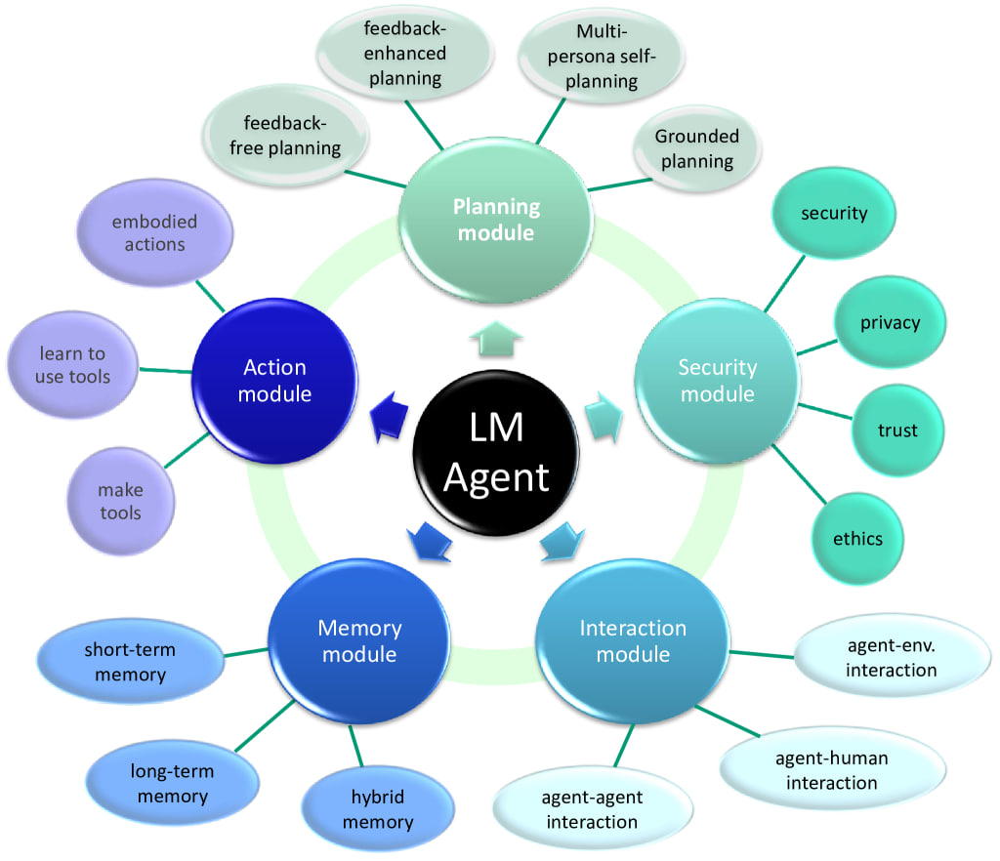
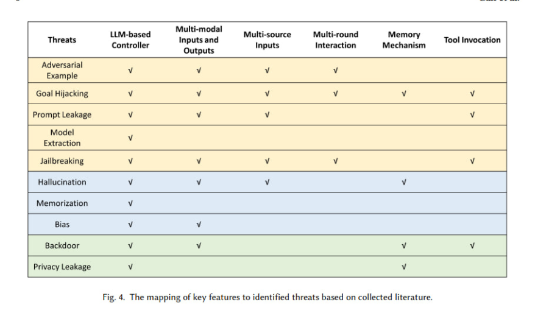

# Безопасность LLM агентов

<figure markdown style="text-align: center;">
{ width="700" }
</figure>

!!! info "О разделе"
    Этот раздел посвящен безопасности LLM агентов, включая уязвимости, атаки и их применение в кибербезопасности.

## Основные концепты

### LLM Agent
LLM Agent - это интеллектуальная система, использующая большую языковую модель для выполнения задач.

!!! note "MultiAgent"
    **MultiAgent**: Когда существует ансамбль из множества агентов, выполняющих одну большую задачу - это называется мульти-агентной системой. Она использует LLM, в качестве ядра, которое отвечает за планирование задач и принятие решений.

### Память

Память в автономных агентах можно разделить на два основных типа:

- **Краткосрочная память**: Способность агента использовать данные из контекста, временно сохраняя информацию во время одного взаимодействия.
- **Долгосрочная память**: Позволяет агенту хранить и вспоминать информацию в течение длительных периодов времени.

### Планирование
Планирование включает способность агента разбивать сложные задачи на управляемые подцели:

- **Декомпозиция задач**: Разбиение большой задачи на меньшие, более управляемые шаги
- **Самоанализ**: Оценка прошлых действий и улучшение стратегий
- **Внешние инструменты планирования**: Использование классических методов планирования

### Действие
Действие относится к выполнению задач на основе планирования и памяти агента:

- **Использование инструментов**: Взаимодействие с внешними API и инструментами
- **ReAct Framework**: Интеграция рассуждений и действий
- **Динамическое взаимодействие**: Адаптация действий на основе обратной связи

<figure markdown style="text-align: center;">
{ width="700" }
</figure>

## Сравнение фреймворков

| Фреймворк | Ключевые особенности | Область применения | Лицензия | Поддержка языков | Распределенные системы |
|:---------:|:------------|:-----------|:--------|:-----------------|:-------------------|
| **LangChain** | - Блочная архитектура - Управление памятью - Интеграция инструментов | Общего назначения | MIT | Python, JavaScript | Ограниченно |
| **AutoGPT** | - Автономное достижение целей - Долгосрочная память - Может писать промпты для себя | Автономные агенты | MIT | Python | Нет |
| **AgentGPT** | - Веб-интерфейс - Декомпозиция задач - GUI | Автоматизация задач | MIT | TypeScript | Да |
| **BabyAGI** | - Приоритизация задач - Простая архитектура - Фокус на обучении | Исследования и образование | MIT | Python | Нет |
| **Lyzr** | - Коммерческая платформа для корпораций  - Масштабируемая архитектура - Готовые агенты с ролями | Решение для корпораций | Commercial | Python | Да |
| **CrewAI** | - Мульти-агентная коллаборация - Агенты с ролями - Координация и управление агентами | Построение сложных агентных систем | Apache 2.0 | Python | Да |

### Ключевые различия

| Категория | Особенности | Примеры/Детали |
|:---------|:---------|:----------------|
| **Фокус на архитектуру системы** | - Ориентация на задачи - Блочная структура - Мульти-агентность - Корпоративное решение | - BabyAGI, AgentGPT - LangChain - CrewAI - Lyzr |
| **Оптимизация под разные применения** | - Исследования - Корпоративные решение - Автоматизация под себя - Для обучения | - Академические проекты - Бизнес-решения - Индивидуальные инструменты - Обучающие платформы |
| **Упрощённый подход к разработке** | - Low-code решения - Программно-интенсивный - Визуальные управление агентами - API-first дизайн | - No-code платформы - Кастомная разработка - Drag-and-drop интерфейсы - API интеграция |
| **Варианты развертывания** | - Cloud-native - Self-hosted - Гибридное развертывание - Edge computing | - Облачные платформы - On-premise решения - Смешанные среды - Edge-devices |

## LLM Агенты в кибербезопасности

### Основные свойства агентов

| Базовые компоненты | Описание |
|:--------------------|:------------|
| **Определение роли** | Специфические функции безопасности и разделение обязанностей |
| **Постановка целей** | Четкие цели для обеспечения защиты и критерии успеха |
| **Предыстория** | Детальные возможности и операционный контекст |
| **Доступ к инструментам** | Интеграция с инструментами безопасности и API |

### Ключевые возможности

| Возможность | Описание |
|:-----------------|:------------|
| **Наследование задач** | Способность получать и делегировать задачи |
| **Управление границами** | Работа в рамках определенных ограничений, которые могут быть наложены на агента |
| **Использование инструментов** | Эффективное применение инструментов безопасности и API |
| **Совместная оценка** | Оценка и координация с другими агентами |

### Применение в безопасности

| Категория | Функции |
|:---------|:---------|
| **Обнаружение угроз** | - Мониторинг в реальном времени - Автоматизированное реагирование на инциденты |
| **Использование в SecOps** | - Круглосуточный автономный мониторинг - Автоматизация рутинных задач |
| **Управление уязвимостями** | - Непрерывная оценка безопасности - Автоматизированное сканирование |
| **Расследование инцидентов** | - Автоматический сбор доказательств - Реконструкция временной шкалы |

## Ландшафт безопасности

### OWASP Top 10 для AI агентов (Неофициальный)

| Категория | Риск | Описание |
|:---------|:-----|:------------|
| [AAC-01](https://github.com/precize/OWASP-Agentic-AI/blob/main/agent-auth-control-01.md) | Захват авторизации и контроля | Несанкционированный контроль действий агента |
| [ACS-02](https://github.com/precize/OWASP-Agentic-AI/blob/main/agent-critical-systems-02.md) | Взаимодействие с критическими системами | Небезопасное взаимодействие с критическими системами |
| [AGI-03](https://github.com/precize/OWASP-Agentic-AI/blob/main/agent-goal-instruction-03.md) | Манипуляция целями | Злонамеренное изменение целей агента |
| [AHE-04](https://github.com/precize/OWASP-Agentic-AI/blob/main/agent-hallucination-04.md) | Эксплуатация галлюцинаций | Использование ложных предположений агента |
| [AIC-05](https://github.com/precize/OWASP-Agentic-AI/blob/main/agent-impact-chain-05.md) | Цепочка воздействия | Каскадные эффекты действий агента |
| [AMC-06](https://github.com/precize/OWASP-Agentic-AI/blob/main/agent-memory-context-06.md) | Манипуляция памятью | Вмешательство в память агента |
| [AOR-07](https://github.com/precize/OWASP-Agentic-AI/blob/main/agent-orchestration-07.md) | Эксплуатация оркестрации | Уязвимости мульти-агентных систем |
| [ARE-08](https://github.com/precize/OWASP-Agentic-AI/blob/main/agent-resource-exhaustion-8.md) | Истощение ресурсов | DoS атаки и истощение ресурсов |
| [ASC-09](https://github.com/precize/OWASP-Agentic-AI/blob/main/agent-supply-chain-09.md) | Атаки на цепочку поставок | Скомпрометированные зависимости |
| [AKP-10](https://github.com/precize/OWASP-Agentic-AI/blob/main/agent-knowledge-poisoning-10.md) | Отравление базы знаний | Загрязнение базы знаний агента |

{ width="700", align=center }

## Практические лаборатории

| Проект | Тип | Особенности | Назначение |
|:--------|:-----|:---------|:---------|
| [Damn Vulnerable LLM Agent](https://github.com/WithSecureLabs/damn-vulnerable-llm-agent) | Уязвимое приложение | - Тестирование ReAct агентов - Сценарии инъекций промптов - Практика Prompt Injection | Изучение атак на LLM агентов |
| [Medusa](https://medusa.detoxio.dev/) | Тестовая платформа | - Тестирование уязвимостей агентов - Оценка безопасности - Симуляция атак | Обучение атакам |

## Исследования и публикации

### Академические статьи

| Название | Авторы | Год | Ключевые выводы |
|:------|:--------|:-----|:-------------|
| [Security Concerns with AI Agents](https://www.vpnranks.com/resources/security-concerns-with-ai-agents/) | VPNRanks | 2024 | - 52.5% утечек данных к 2025 - Рост рынка до $7.41B |
| [Key Challenges in AI Agent Security](https://taleliyahu.medium.com/key-challenges-in-ai-agent-security-332d718ec8b4) | Tal Eliyahu | 2024 | - Описывает риски конфиденциальности - Проблемы для обеспечения безопасности агентов |
| [Beyond RCE: Autonomous Code Execution](https://www.securityrunners.io/post/beyond-rce-autonomous-code-execution-in-agentic-ai) | Security Runners | 2024 | - Описывает риски выполнения кода - Угрозы среде, где агент может быть использован |
| [Exploiting Huggingface's Assistants](https://www.lasso.security/blog/exploiting-huggingfaces-assistants-to-extract-users-data) | Lasso Security | 2023 | - Описывает уязвимости извлечения данных из агентной системы, которая была сделана в huggingface|

### Инструменты и фреймворки для применения в ИБ

| Проект | Тип | Описание | Особенности |
|:--------|:-----|:------------|:----------|
| [HackSynth](https://github.com/aielte-research/HackSynth) | Фреймворк | Тестирование безопасности AI | - Оценка уязвимостей - Симуляция атак |
| [OsintAGI](https://github.com/wearetyomsmnv/OsintAGI/) | Инструмент | Автоматизация OSINT | - Сбор информации - Анализ данных |
| [Agent-Smith](https://github.com/sail-sg/Agent-Smith) | PoC | Эксплуатация уязвимостей | - Jailbreak - Уязвимости агентов |
| [AI-OPS](https://github.com/antoninoLorenzo/AI-OPS) | Платформа | Тестирование безопасности| - Обнаружение рисков - Автоматизация реагирования |
| [PentAGI](https://github.com/vxcontrol/pentagi/) | Инструмент | Тестирование безопасности | - Автономные AI агенты - Мониторинг |

### Бенчмарки и оценки безопасности агентов

| Проект | Фокус | Метрики | Ключевые особенности |
|:--------|:------|:--------|:-------------|
| [Agent-Attack](https://github.com/ChenWu98/agent-attack) | Тестирование атак | Уязвимости безопасности | - Векторы атак - Оценка защиты - Оценка рисков |
| [Auto-Pen-Bench](https://github.com/lucagioacchini/auto-pen-bench) | Пентест | Бенчмарки безопасности | - Автоматизированное тестирование - Метрики производительности - Оценка безопасности |
| [ASB](https://github.com/agiresearch/ASB) | Бенчмарк безопасности | Безопасность агентов | - Метрики безопасности - Анализ производительности - Тестирование уязвимостей |
| [LLM-Agent-Benchmark](https://github.com/zhangxjohn/LLM-Agent-Benchmark-List) | Комплексный | Оценка агентов | - Тестирование безопасности - Метрики производительности - Коллекция бенчмарков |

### Проекты 

| Проект | Тип | Назначение | Особенности |
|:--------|:-----|:--------|:----------|
| [Multi-Agent-SecOps](https://github.com/tegridydev/multi-agent-secops-llm) | SecOps | Безопасность с использованием агентов и LLM | - Обнаружение угроз - Автоматизация реагирования - Мониторинг безопасности |
| [Cyber-Security-LLM-Agents](https://github.com/NVISOsecurity/cyber-security-llm-agents) | SecOps | Безопасность с использованием агентов | - Автоматизация безопасности - Анализ угроз - Координация агентов для реагирования на инциденты |
| [Ridge Security](https://ridgesecurity.ai/) | Платформа | AI решение для безопасности | - Оценка уязвимостей - Тестирование безопасности - Управление рисками |

### Технические презентации

| Название | Организация | Год | Ключевые темы |
|:------|:-------------|:-----|:-----------|
| [The Double AI Agent](http://i.blackhat.com/EU-24/Presentations/EU-24-Cohen-TheDoubleAIAgent.pdf) | Black Hat EU | 2024 | - Техники манипуляции агентами - Сценарии двойных агентов |
| [Mind the Data Gap](http://i.blackhat.com/EU-24/Presentations/EU-24-Pappu-Mind-the-Data-Gap.pdf) | Black Hat EU | 2024 | - Приватность в AI агентах - Мульти-агентные системы |
| [Agentic AI: New Frontier](https://aisuf.org/blogs/f/agentic-ai-a-new-frontier-in-security) | AI Security Union | 2024 | - Про то, как AI Agents могут быть использованы в кибербезопасности - Тренды |
| [Agent Security Analysis](https://arxiv.org/abs/2409.10737) | arXiv | 2024 | - Фреймворки безопасности - Оценка уязвимостей |

## Ресурсы сообщества

- [OWASP AI Agent Security Project](https://github.com/precize/OWASP-Agentic-AI/) - Неофициальный репозиторий
- [OWASP Slack #team-llm-autonomus-agents](https://owasp.slack.com/archives/team-llm-autonomus-agents) - Обсуждения сообщества

<figure markdown style="text-align: center;">
{ width="400" }
</figure> 
